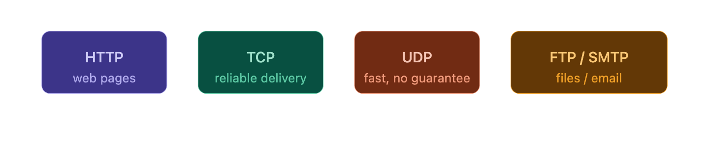
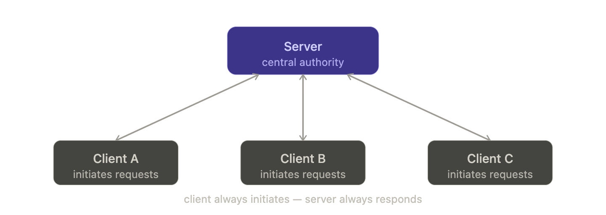
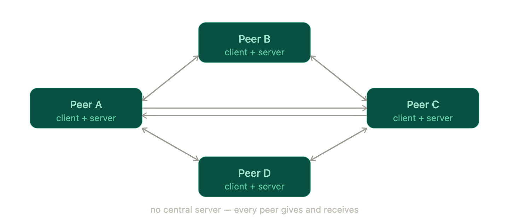
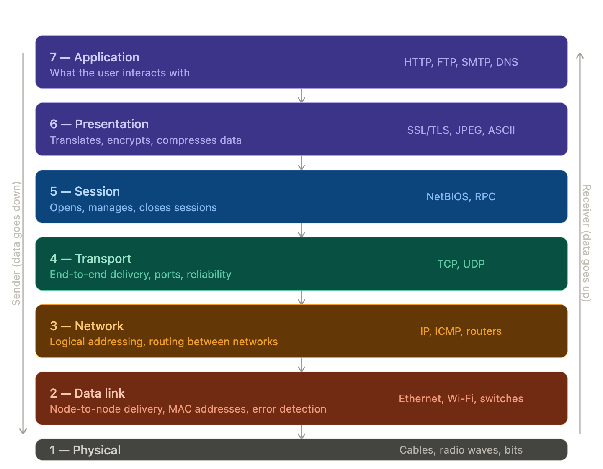
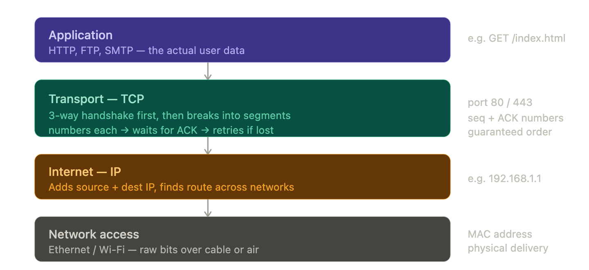
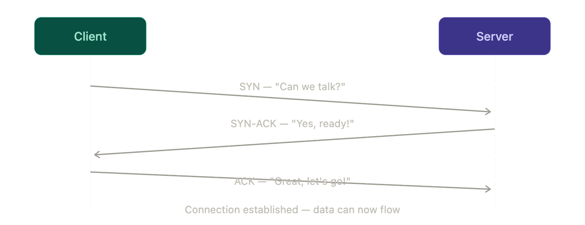
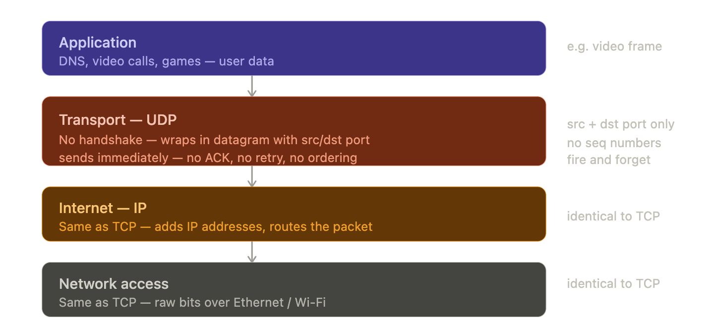
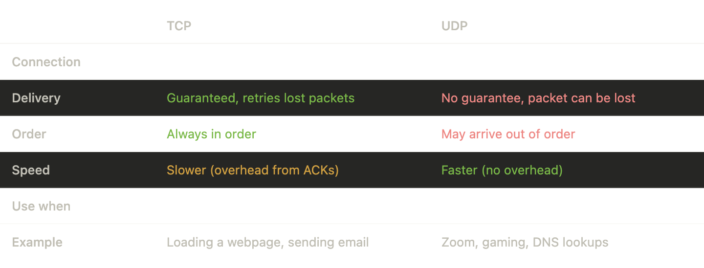
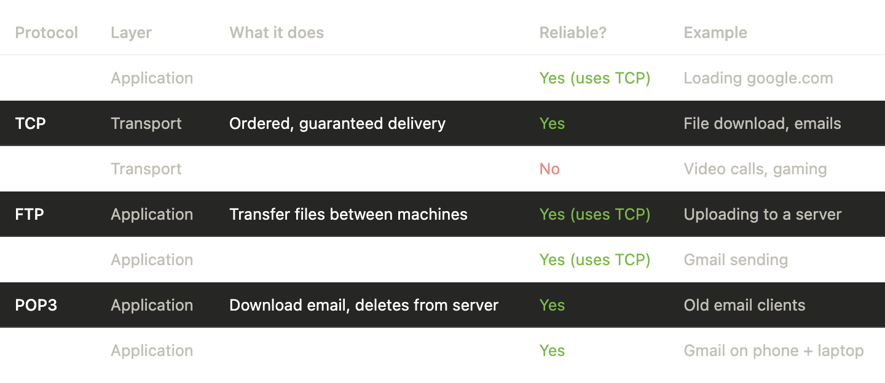
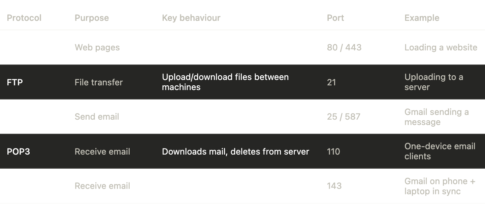

# Networking - Protocols, Models & Layers

## 1. Network Protocols

Protocols are agreed-upon rules that define how data is formatted, transmitted, and received between devices. Think of them as languages — both sides must speak the same one for communication to work.

## 2. Client-Server Model

- **Client** — the device that asks for something (e.g. your browser)
- **Server** — the device that fulfils the request (e.g. Google's servers)
- Communication is **always initiated by the client**
- One server can serve many clients simultaneously

**Example:** You type `google.com` → your browser sends a request → Google's server sends back the HTML page.

## 3. Peer-to-Peer (P2P) Model

No central server. Every device acts as both a client and a server — each "peer" can give and take.

**Example:** BitTorrent — you download a file from multiple people at once while also uploading pieces to others.

> **WebSockets** — a protocol that keeps a persistent, two-way connection open between client and server, so either side can send data at any time. Unlike HTTP (where the client must always ask first), WebSockets allow the server to push data. Used in: live chat, stock tickers, multiplayer games.

## 4. OSI Model — 7 Layers

A conceptual reference model used for understanding and troubleshooting networks. Data travels **down** the layers when sending, and **up** when receiving. Each layer wraps data in its own header — this is called **encapsulation**.

**Memory trick:** *"All People Seem To Need Data Processing"*

## 5. TCP — Transmission Control Protocol

**Connection-first.** Before any data moves, both sides perform a **3-way handshake**. Every segment is numbered; the receiver must confirm each one with an ACK. If a segment is lost, it gets resent. Nothing is lost, nothing arrives out of order.

**Example:** Loading a webpage. Your browser sends an HTTP request. TCP ensures every byte of HTML arrives correctly and in order. A missing packet triggers a retry — you never see a half-loaded page because of TCP.

### The 3-Way Handshake

1. **SYN** — Client says "Can we talk?"
2. **SYN-ACK** — Server replies "Yes, ready!"
3. **ACK** — Client confirms "Great, let's go!"

Connection is now established — data can flow.

## 6. UDP — User Datagram Protocol

**No setup, no confirmation.** Data is wrapped in a datagram with just source and destination ports, then fired immediately. The sender never knows if it arrived — no handshake, no ACK, no retry, no guaranteed order.

**Example:** A Zoom call. Each video frame is a datagram fired out. If one drops, Zoom skips it — you see a brief glitch and move on. Waiting to retry a dropped frame would be worse, because by the time it arrived, it would already be outdated.

## 7. TCP vs UDP

> The bottom two layers (IP + network access) are **identical** for both TCP and UDP. The only difference is at the **transport layer**.

## 8. OSI vs TCP/IP Model

OSI is a **conceptual model** used for teaching and troubleshooting. TCP/IP is what's **actually implemented** on the real internet — it just breaks things into fewer layers.

| OSI Layers | TCP/IP Equivalent |
|---|---|
| 7, 6, 5 (Application, Presentation, Session) | Application layer |
| 4 (Transport) | Transport layer |
| 3 (Network) | Internet layer |
| 2, 1 (Data Link, Physical) | Network access layer |

## 9. Protocol Comparison — HTTP, TCP, UDP, FTP, SMTP, POP3, IMAP

**POP3 vs IMAP in one line:**
- **POP3** downloads email to one device and removes it from the server
- **IMAP** keeps email on the server and syncs it across all your devices — this is why Gmail looks the same on your phone and laptop

## 10. Application Layer Protocols (Layer 7)

All of these sit at OSI Layer 7 and use TCP underneath — **except DNS**, which can use UDP.

## Key Takeaways

- **Protocol** = agreed language between two devices
- **Client-server** = one serves many; **P2P** = everyone serves everyone
- **OSI** = 7 layers for understanding; **TCP/IP** = 4 layers actually used
- **TCP** = reliable, ordered, slower (handshake + ACKs); **UDP** = fast, no guarantees
- **HTTP, FTP, SMTP, POP3, IMAP** all sit on top of TCP at the application layer
- **WebSockets** = HTTP that stays open and is bidirectional
- **POP3** = takes email home; **IMAP** = mirrors email everywhere
