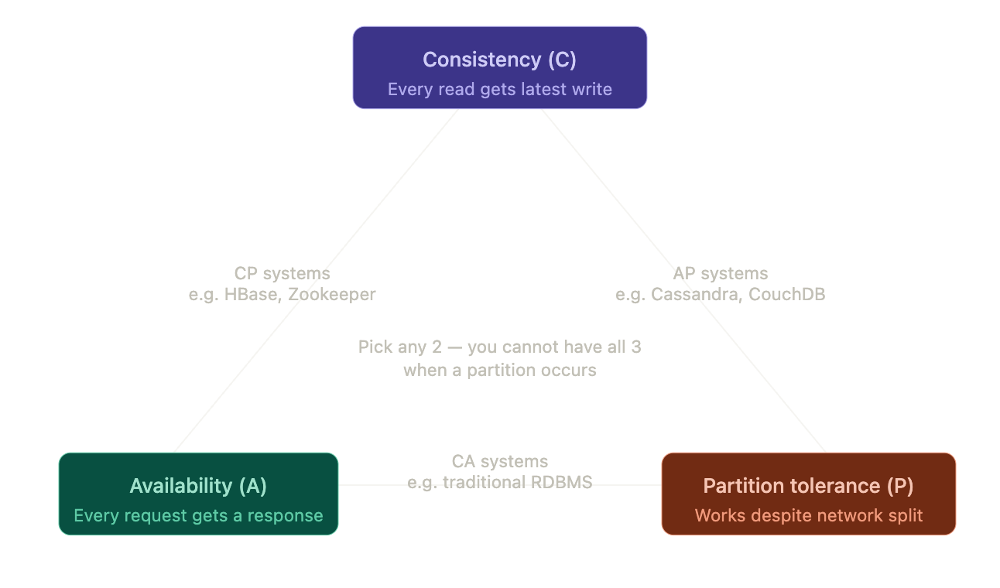
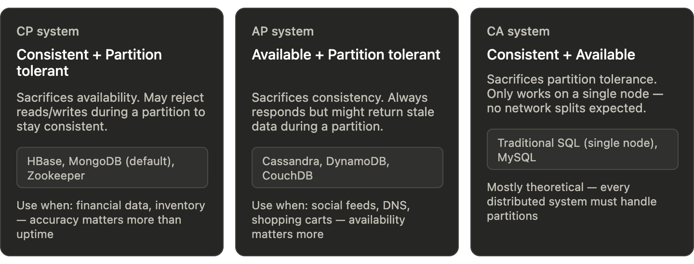
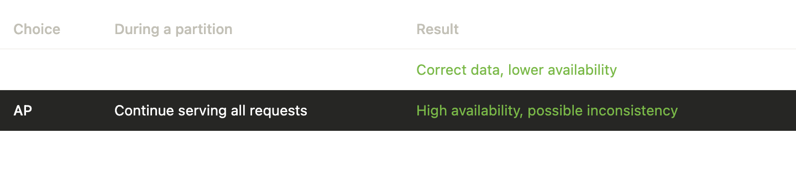

# CAP Theorem

## 1. CAP Theorem

The CAP theorem says that in a distributed system, you can guarantee at most two out of three properties when a network partition occurs.

## 2. The 3 Properties

- **Consistency (C)** — every read gets the latest write (or an error). If you write `x = 5` on one node, reading from another should also return `5`.
- **Availability (A)** — every request gets a non-error response, even if that response may be stale.
- **Partition Tolerance (P)** — the system continues operating even when nodes cannot communicate because of network failure.

## 3. Why You Cannot Have All 3 Together

When a partition happens, nodes are split and cannot sync. At that point, you must choose:

- keep serving requests from both sides (favor **A**) and risk stale/conflicting data (lose **C**)
- reject or delay some requests until sync is restored (favor **C**) and lose **A**

Because partitions are unavoidable in real systems, **P is usually required**, so the practical trade-off is **C vs A**.

## 4. The 3 Combinations

- **CP (Consistency + Partition Tolerance)** — system preserves correctness during partition by rejecting or pausing some requests.
- **AP (Availability + Partition Tolerance)** — system stays responsive during partition but may return stale data until nodes reconcile.
- **CA (Consistency + Availability)** — works only when there is no partition. In truly distributed production systems, this is usually not realistic.

## 5. CP vs AP During Failure

## 6. Real-World Analogy

Imagine two bank branches (Node A and Node B) that keep account balances in sync. The network link between them fails:

- **CP choice** — branches stop some transactions until connection returns. Balance stays correct, but service is limited.
- **AP choice** — both branches keep processing transactions. Service continues, but balances can temporarily diverge.

## 7. One-Liner for Revision

> CAP means you cannot guarantee Consistency, Availability, and Partition Tolerance all at once during a partition; in practice, you choose between C and A while tolerating P.

## Key Takeaways

- CAP trade-offs matter **only when partition happens**
- In real distributed systems, **P is non-negotiable**
- So the real design choice is usually **CP vs AP**
- **CP** favors correctness; **AP** favors responsiveness