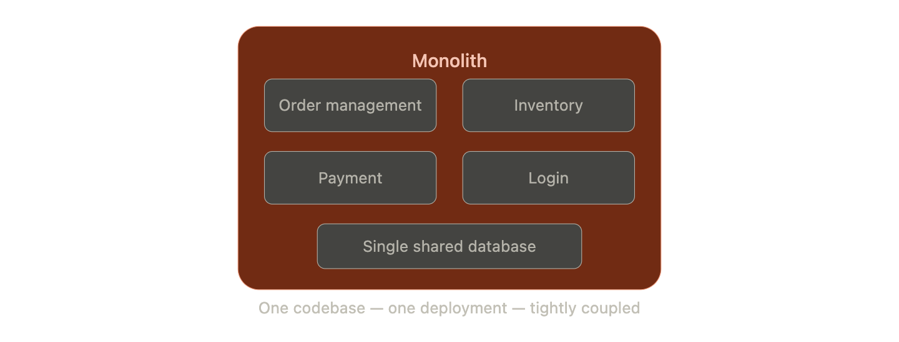
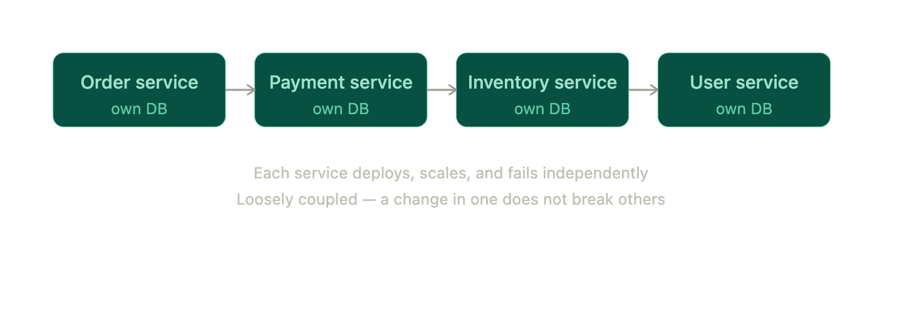
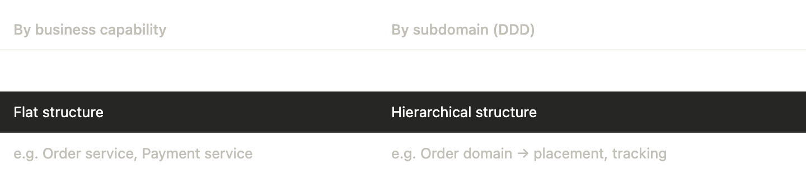
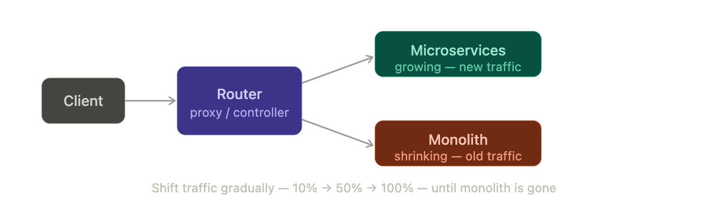
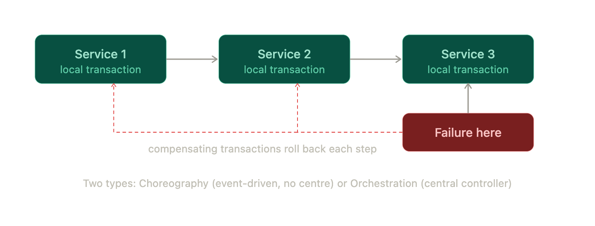
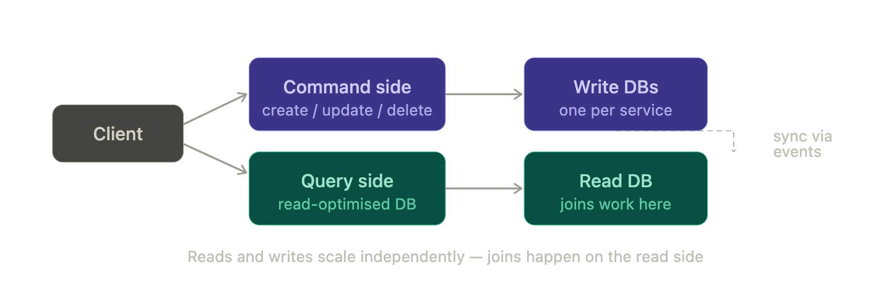

# Microservices - Architecture & Patterns

## 1. Monolithic Architecture

A single large application where everything — orders, payments, inventory, login — lives and deploys together as one unit.

- One codebase, one deployment, one database
- All modules are tightly coupled — a change in one area can ripple across others
- To handle more load, you must scale the *entire* app, not just the busy part

**Problems with monolith:** overloaded codebase (can reach GBs), tight coupling means a small change risks breaking unrelated modules, you can't scale just the payment service — you must scale the entire app, and every small fix needs a full redeploy.

## 2. Microservices Architecture

Break the app into small, independent services — each one owns a specific job, its own codebase, and its own database. They talk to each other over a network.

**Advantages:** loose coupling, independent deployment, easier debugging per service, scale only what you need, cost efficient, better maintainability.

**Disadvantages:** poor decomposition leads to tight coupling anyway, service-to-service calls add latency, errors propagate across services making debugging complex, monitoring is harder, and distributed transactions across multiple DBs are tricky.

## 3. Decomposition Patterns

How do you decide where to draw the boundaries between services? Two main approaches:

**By business capability** — split based on what the business *does*. Order service handles orders, payment service handles payments. Straightforward, but requires strong business understanding.

**By subdomain (Domain Driven Design)** — first identify the broader domain, then divide into subdomains. More structured and hierarchical.

## 4. Strangler Pattern (Migration Strategy)

Used when migrating an existing monolith to microservices — you can't rewrite everything at once.

Introduce a proxy/router in front of the monolith. Gradually shift traffic to new microservices while the monolith shrinks. Eventually the monolith is gone entirely — "strangled" out.

Safe migration with easy rollback if a new service fails.

## 5. Database Design — Shared vs Per Service

**Shared database** — all services use one DB. Looks simple but creates tight coupling, schema conflicts, and scaling problems. Avoid.

**Database per service** — each service owns its data. Independent scaling, technology flexibility (one service can use SQL, another NoSQL). This is the right approach.

> The catch: with no shared DB, you lose easy joins and ACID transactions across services. This is the distributed transactions problem — solved by the SAGA pattern.

## 6. SAGA Pattern

When a single business operation spans multiple services (each with their own DB), you need a way to keep everything consistent without a shared transaction.

SAGA breaks the operation into a **sequence of local transactions**. Each service does its piece, then publishes an event for the next one. If anything fails, compensating transactions roll back the previous steps.

**Example — transfer money from A to B:**

1. Balance service deducts from A → publishes event
2. Payment service records transfer → publishes event
3. If payment fails → SAGA triggers compensation → Balance service refunds A

**Choreography** — services react to each other's events directly. Decoupled, but hard to debug and can create circular dependencies.

**Orchestration** — a central orchestrator tells each service what to do. Easier to track and debug, but creates a central dependency.

## 7. CQRS Pattern

**Problem:** with each service owning its own DB, you can't do joins across services. Reading data that spans multiple services becomes painful.

**Solution — Command Query Responsibility Segregation (CQRS):** split reads and writes into two separate sides.

- **Command side** — handles Create, Update, Delete (writes to each service's own DB)
- **Query side** — maintains a separate read-optimised database, kept in sync via events or scheduled jobs

The read DB is kept in sync via events or scheduled jobs. Reads become fast and easy to join. Reads and writes can scale independently.

## Core dump

> Microservices break a monolith into independent services — but independence comes at a cost: distributed transactions (solved by SAGA), cross-service reads (solved by CQRS), and migration complexity (solved by the Strangler pattern).

## Key Takeaways

- **Monolith** = one codebase, tightly coupled, hard to scale individual parts
- **Microservices** = independent services, each with its own DB, loosely coupled
- **Decomposition** is the hardest part — poor boundaries create tight coupling anyway
- **Database per service** is the right pattern, but kills easy joins and ACID transactions
- **SAGA** = sequence of local transactions with compensating rollbacks on failure
- **CQRS** = separate read and write sides; read DB is synced via events
- **Strangler pattern** = safe way to migrate monolith → microservices gradually
- Choreography = decentralised (events); Orchestration = centralised (controller)